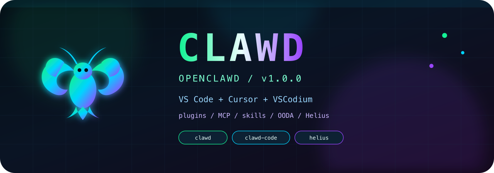

<p align="center">
  
</p>

<p align="center">
  <a href="LICENSE"></a>
  
  
  
  
</p>

<p align="center">
  <b>OpenClawd</b> pack for VS Code, Cursor, and VSCodium — one VSIX, three production plugins, a living MCP catalog.<br/>
  <a href="https://github.com/solizardking/extension">github.com/solizardking/extension</a>
  ·
  <a href="https://cheshireterminal.ai">cheshireterminal.ai</a>
</p>

---

## What just crawled into your editor?

Clawd is a **VS Code / Cursor / VSCodium extension** that reads `.cursor-plugin/marketplace.json` and ships the three production plugins:

| Plugin | Vibe | Ships in the VSIX |
| --- | --- | --- |
| **clawd** | Six-law harness, OODA trading, Cheshire Terminal MCP, MoonPay signed on-ramp URLs, Solana agent catalog | yes |
| **clawd-code** | Solana coding agent, paper-gated perps, Helius / DFlow / Jupiter / Phantom, Agent Arena | yes |
| **helius** | Helius + core-ai: MCP, CLI, DAS / Sender, DFlow / Jupiter / Phantom / OKX, Pump, Grok, Solana docs | yes |
| **starter-simple** / **starter-advanced** | Author templates (rules, skills, agents, hooks, MCP) | repo only |

On **Cursor**, activation copies those plugins into `~/.cursor/plugins/local`. On **VS Code / VSCodium**, you still get the MCP servers, settings, status bar, and activity bar. Same lobster. Different shells.

```
     🦞  marketplace.json
           ├─ clawd
           ├─ clawd-code
           └─ helius  ──►  ~/.cursor/plugins/local
                           + MCP provider "Clawd MCP Servers"
                           + activity bar + status bar
```

---

## Quick start (the fun way)

### 1. F5 it

Press **F5** (`Run Extension`). An Extension Development Host pops open with this folder loaded. Look left: the **Clawd** activity bar. Look down: the **Clawd** status badge.

### 2. Or install the `.vsix`

```bash
npm install
npm run package          # → clawd-1.0.0.vsix
```

Then **Extensions → ⋯ → Install from VSIX…** → reload.

### 3. If Cursor forgot the plugins

Command Palette → **Clawd: Install Cursor Plugins**. Reload if they don't show under Customize.

Command Palette → **Clawd: Install Cursor Plugins**. Status bar badge shows live plugin + MCP count.

---

## Inside the shell

The extension is JavaScript — **no compile step**. Architecture is the Solana-VS-Code playbook (status bar, commands, feature modules) without copying anyone else's scanners.

| Surface | What it does |
| --- | --- |
| **Activity bar → Clawd** | Marketplace name, plugin install state, MCP ready vs needs-setup |
| **Status bar** | `Clawd` badge → **Clawd: Show Status** |
| **Output channel** | Timestamped install / settings / activation logs |
| **MCP provider** | Unions every bundled plugin's `mcp.json` (deduped) |

### Command palette

| Command | Job |
| --- | --- |
| `Clawd: Install Cursor Plugins` | Copy bundled plugins into `~/.cursor/plugins/local` |
| `Clawd: Open Cursor Plugins Folder` | Open that folder |
| `Clawd: Show Status` | Dump marketplace + plugin + MCP status to the Clawd output channel |
| `Clawd: Show Output` | Focus the log |
| `Clawd: Open Settings` | Jump to `clawd.*` |
| `Clawd: Refresh` | Re-read settings, tree, and MCP definitions |
| `Clawd: Focus Explorer` | Open the activity bar view |

HTTP MCP servers (Solana docs, DFlow, ZK Compression, Cheshire Terminal, Phoenix, PayBox, Robinhood) register as soon as the plugin catalog has them. Local stdio servers (Helius, Pump, Grok, Clawd Code, Zero, ClawdBrowser) wait until the matching path / key exists.

---

## Settings / env (feed the lobster)

| Setting | Env | Why |
| --- | --- | --- |
| `clawd.installCursorPluginsOnActivate` | — | Auto-copy plugins on activate (default `true`) |
| `clawd.heliusApiKey` | `HELIUS_API_KEY` | Helius + Pump MCP |
| `clawd.solanaRpcUrl` | `SOLANA_RPC_URL` | RPC (defaults to mainnet) |
| `clawd.cheshireApiKey` | `CHESHIRE_API_KEY` | Bearer for `https://cheshireterminal.ai/mcp` |
| `clawd.xaiApiKey` | `XAI_API_KEY` | Clawd Grok MCP |
| `clawd.coreAiRoot` | `CORE_AI_ROOT` | `helius-mcp`, Pump MCP, `clawd-grok` |
| `clawd.cheshireTerminalRoot` | `CHESHIRE_TERMINAL_ROOT` | Cheshire `mcp-server` |
| `clawd.clawdCodeRoot` | `CLAWD_CODE_ROOT` | Clawd Code CLI (`dist/cli.js`) |
| `clawd.zeroClawdRoot` | `ZERO_CLAWD_ROOT` | zero-clawd MCP |
| `clawd.clawdBrowserRoot` | `CLAWDBROWSER_ROOT` | ClawdBrowser MCP |

Paper first. Live trades, sends, and secret-touching shell still need a human.

---

## Publish

Publisher ID in `package.json` is `clawd` — it must match the publisher you created on the Marketplace.

<details>
<summary><b>Microsoft Marketplace</b> (VS Code + Cursor Extensions tab)</summary>

1. Create a publisher at the [Visual Studio Marketplace management portal](https://marketplace.visualstudio.com/manage).
2. Sign in to Azure DevOps, create a PAT with **Marketplace (Acquire & Publish)**.
3. Publish:

```bash
npx @vscode/vsce login clawd
npx @vscode/vsce publish
```

Or upload `clawd-1.0.0.vsix` with **New Extension** on the marketplace site.

</details>

<details>
<summary><b>Open VSX</b> (VSCodium and other open editors)</summary>

```bash
npx ovsx publish clawd-1.0.0.vsix -p YOUR_OPEN_VSX_TOKEN
```

</details>

---

## Cursor plugin marketplace (no VSIX required)

Cursor Plugins (rules, skills, agents, commands, hooks) can also be listed from this public repo:

1. [cursor.directory/plugins/new](https://cursor.directory/plugins/new) — community, fastest
2. [cursor.com/marketplace/publish](https://cursor.com/marketplace/publish) — official, manual review

Repo: `https://github.com/solizardking/extension`

### Authoring another plugin

1. `.cursor-plugin/marketplace.json` — marketplace `name`, `owner`, `metadata`
2. `plugins/<name>/.cursor-plugin/plugin.json` — kebab-case `name`, `displayName`, `author`, `description`, `keywords`, `license`, `version`
3. Drop in rules, skills, agents, commands, hooks, scripts, logos
4. `npm run validate`
5. See [`docs/add-a-plugin.md`](docs/add-a-plugin.md)

Starter plugins stay in git so you can clone the pattern. They are **not** packed into the VSIX.

Based on the [Cursor plugin template](https://github.com/cursor/plugin-template).

---

<p align="center">
  
</p>

<p align="center">
  <sub>Six laws. Paper default. Reload if the claw doesn't wave back.</sub>
</p>
